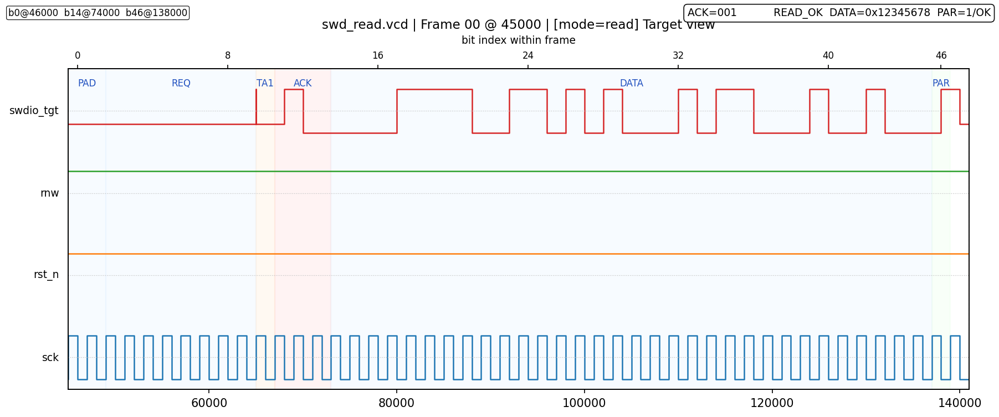
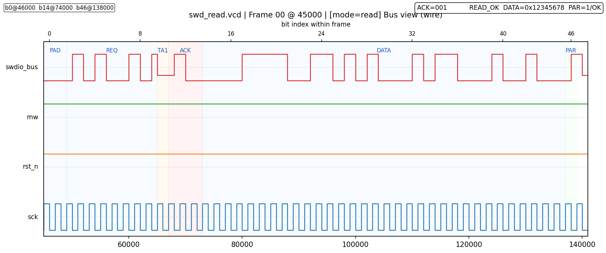
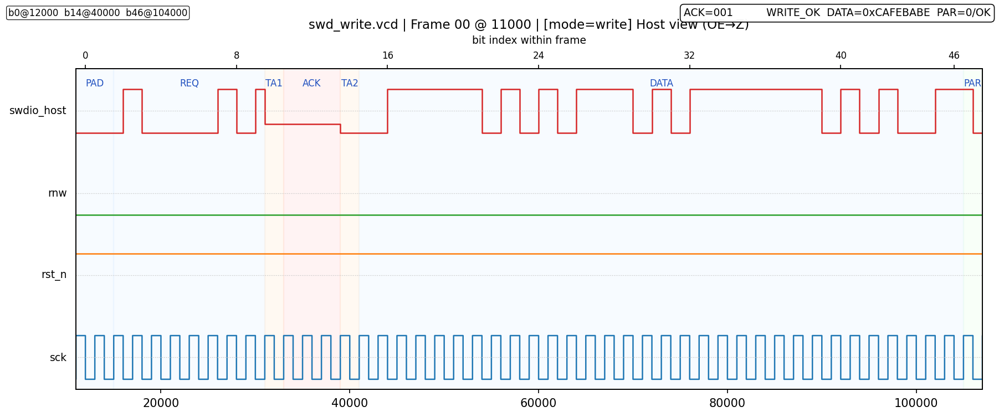
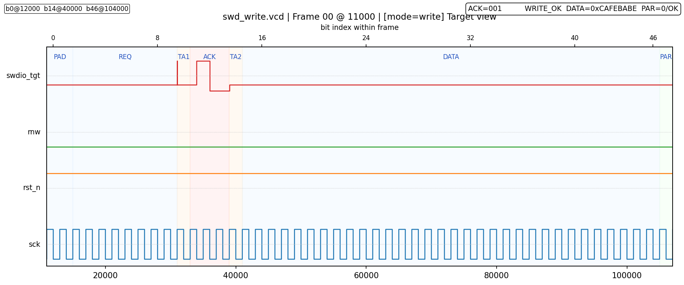
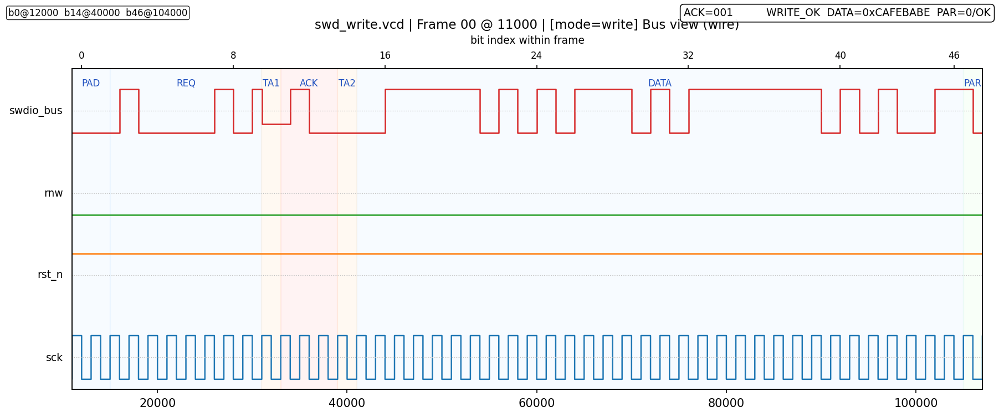
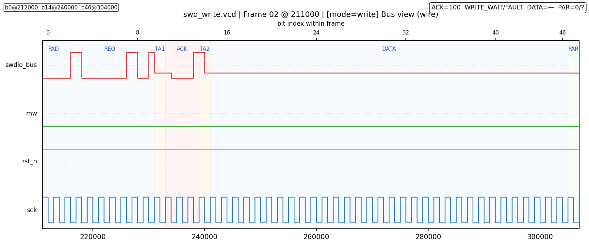
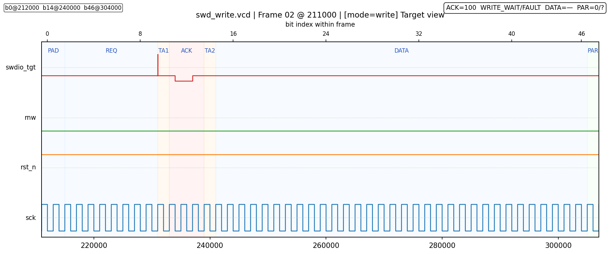
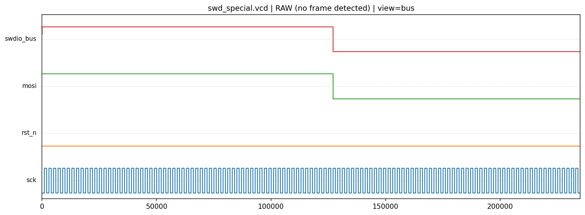

# XRDAP-SWD-Probe

> Open SWD probe (discrete + FPGA) with XRDAP adapter  
> 开源 SWD 探针（分立元件 + FPGA），用于 XRDAP 调试器

---

## 目标 / Goals

实现一个 **成本低、结构简单、行为稳定** 的 SWD 数字前端，使任何带 SPI 接口的主机（MCU / SBC / SoC）都可以：

- 用 **固定 48bit SPI 传输 + 少量 GPIO** 完成标准 SWD 访问；
- 在访问过程中依靠 **DMA / FIFO 连续传输**，避免中途 bit-bang；
- 在较高 SWCLK 频率下，仍然满足 SWD 的 REQ / TURN / ACK / DATA / PARITY / IDLE 时序要求。

---

## 背景问题 / Pain Points

直接使用 MCU + GPIO 软件实现 SWD，常见问题包括：

1. **位宽难以与 SPI 帧对齐**  
   单次 SWD 访问约需 46 个 SWCLK 周期，不方便直接映射到 8/16bit SPI 帧。

2. **总线换向（turnaround）时序敏感**  
   REQ 之后 SWDIO 需在主机与目标之间切换，写访问还可能存在第二次换向；  
   完全由软件控制 IO 方向，在高频下容易产生方向冲突或时序误差。

3. **ACK 分支影响访问流程**  
   SWD 定义 OK / WAIT / FAULT 多种 ACK，软件需根据 ACK 决定是否进入 data phase 或执行错误恢复。  
   在 SPI + DMA 模型下，如希望高效连续传输，需要清晰的访问抽象。

---

## 总体思路 / Approach

### 1. 固定 SPI 帧 + “前 15 位有语义，之后视作 after-ACK 流”

主机侧建议：

- **固定 48bit SPI 帧**，LSB first；
- 每次 SWD 访问 = 一帧 SPI 传输（DMA 发送 6 字节）；
- 每帧开始前短暂拉低一次 `rst_n`，作为该帧的逻辑复位。

前端的抽象更简单：

- 仅在 `rst_n` 拉高后的 **前 15 个 SWCLK 上升沿** 精细区分 bit 位置；
- 第 15 个上升沿之后的所有时钟，一律视作 **“ACK 之后的比特流（after-ACK stream）”**：
  - 不再关心具体 bit 序号；
  - 不依赖“固定 48bit 帧长度”的假设；
  - 后续行为仅由「这是 ACK 之后」+ RnW + ACK 是否 OK 决定。

> 推荐使用 48bit 帧是方便软件实现；  
> 前端本身只区分“前 15 位”和“之后所有位”。

#### 1.1 前 15 位的逻辑布局（前端视角）

以 `rst_n` 从 0→1 后的 SWCLK 上升沿计数 `bit_idx = 0, 1, 2, ...` 为例：

| bit_idx | 角色             | 说明                                                                       |
| ------- | ---------------- | -------------------------------------------------------------------------- |
| 0..1    | PADDING          | 主机输出 0，用于对齐计数器                                                 |
| 2..9    | REQ_WINDOW       | 标准 SWD Request 8bit（主机驱动 SWDIO，LSB-first）                         |
| 10      | TURN1            | REQ→ACK 的 turnaround，前端停止驱动                                        |
| 11..13  | ACK_WINDOW       | 目标驱动 ACK[0..2]，前端采样并解码                                         |
| 14      | 数据/换向分界    | **READ：目标开始驱动 DATA[0]；WRITE：第二次 turnaround（主机可占位或 Z）** |
| ≥15     | AFTER_ACK_STREAM | ACK 之后的比特流，前端不再区分索引                                         |

ACK_WINDOW 中的 3bit 解码为：

- `001` = OK
- `010` = WAIT
- `100` = FAULT
- 其他视作非法，统一 `ack_ok = 0`。

#### 1.2 与官方 SWD 时序对齐（READ / WRITE / FAULT / IDLE）

为方便对照 ARM 《Serial Wire Debug》规范，下表把 **“SPI 48bit 帧中的逐位行为”** 映射到 **标准 SWD REQ → TURN → ACK → DATA → PARITY → IDLE** 的阶段：

##### READ（ACK=001）

| bit_idx | SWDIO 驱动者 | 官方阶段              | 说明（LSB-first）                                            |
| ------- | ------------ | --------------------- | ------------------------------------------------------------ |
| 0..1    | 主机（MOSI） | Idle/padding          | 人为插入的 2bit idle，确保计数器归零且 SWDIO=0               |
| 2..9    | 主机（MOSI） | Request[0..7]         | `start, APnDP, RnW, A[3:2], parity, stop, park`              |
| 10      | 全线高阻     | Turnaround #1         | 满足“REQ → ACK 至少 1 个周期的总线释放”                      |
| 11..13  | 目标         | ACK[0..2]             | LSB-first，前端在窗口内捕获到移位寄存器                      |
| **14**  | **目标**     | **数据开始**          | **DATA0**（READ 只有这一次换向；ACK 后即由目标开始驱动数据） |
| 15..45  | 目标         | DATA[1..31]           | bit45 = DATA31                                               |
| 46      | 目标         | PARITY                | `PARITY = XOR(DATA[31:0])`                                   |
| ≥47     | 全线高阻     | Idle / 下一帧 padding | 可继续输出 SWCLK 作为 idle、dummy 或下一帧的 padding         |

###### 主机视角

###### 目标视角

###### 总线视角

##### WRITE（ACK=001）

| bit_idx | SWDIO 驱动者       | 官方阶段              | 说明（LSB-first）                                   |
| ------- | ------------------ | --------------------- | --------------------------------------------------- |
| 0..1    | 主机               | Idle/padding          | 同 READ                                             |
| 2..9    | 主机               | Request[0..7]         | `start → park`                                      |
| 10      | 全线高阻           | Turnaround #1         | 主机释放，等待目标发 ACK                            |
| 11..13  | 目标               | ACK[0..2]             | 捕获到前端移位寄存器                                |
| **14**  | 主机或高阻（可选） | **Turnaround #2**     | **主机可已开始驱动（占位）或保持 Z**                |
| 15..46  | 主机（MOSI）       | DATA[0..31]           | bit15 = DATA0，bit46 = DATA31                       |
| 47      | 主机（MOSI）       | PARITY                | `PARITY = XOR(DATA[31:0])`                          |
| ≥48     | 主机 / 高阻        | Idle / 下一帧 padding | ACK≠001 时保持高阻，只送 idle；ACK=001 可接续下一帧 |

###### 主机视角

###### 目标视角

###### 总线视角

##### WAIT / FAULT / Illegal ACK

- 11..13 与标准 SWD 完全一致；  
- **ACK≠001** 时，14 及之后均保持高阻，不写入数据；  
- 软件可在 after-ACK 流中只发送 SWCLK（MOSI=0）等待目标恢复，或拉低 `rst_n` 进入 raw 模式执行 line reset。

###### 主机视角

###### 目标视角

###### 总线视角

##### Idle / Line Reset

- **Idle**：在一次访问 ACK 结束后，主机保持 `rst_n=1`、SWDIO 释放，只需继续输出 SWCLK，即可形成任意长度的 idle。若需要 dummy 访问，可连续发送“只有 padding+REQ+ACK 的短帧”。  
- **Line reset / SWJ 切换**：把 `rst_n` 拉低到 0 进入 raw 模式后，MOSI 直接透传到 SWDIO。此时在 MOSI 上保持 `1` 并输出 ≥50 个 SWCLK，即可完成 line reset；紧接着输出 `0xE79E` 等 SWJ 序列由主机控制，无额外逻辑插入。

三套 testbench（`testbench_read.v` / `testbench_write.v` / `testbench_special.v`）共享 `tb_timing_helpers.vh`，在仿真时逐位检查：

- padding / REQ 由主机驱动且值正确；  
- **需要的 turnaround 位内总线完全释放（READ 一次、WRITE 两次）**；  
- ACK LSB-first、且仅在 ACK=001 时允许主机进入写数据阶段；  
- WAIT / FAULT / RAW / line-reset 序列的每一位都与 SWD 规范匹配。  

执行 `./src/run_all.sh` 后，可运行 `python3 src/vcd_to_png.py` 生成 `src/png/*.png` 以人工复核波形。

---

### 2. 事务行为（前端视角）

前端只依赖三个逻辑信号决定行为：

- `rnw`：1 = READ，0 = WRITE（由主机在访问之前拉好）；  
- `ack_ok`：ACK 是否为 `3'b001`；  
- `after_ack`：是否已经进入 AFTER_ACK_STREAM（bit_idx ≥ 15）。

在此基础上，前端只区分 4 种事务行为：

| 场景               | PADDING+REQ (0..9)    | TURN1+ACK+TURN2 (10..14)          | AFTER_ACK_STREAM (≥15)                    |
| ------------------ | --------------------- | --------------------------------- | ----------------------------------------- |
| **READ + ACK=OK**  | 主机驱动 SWDIO = MOSI | 主机→目标一次换向，目标驱 ACK     | 前端高阻，目标输出 DATA+PARITY，MISO 回读 |
| **READ + ACK≠OK**  | 主机驱动 SWDIO = MOSI | 主机→目标一次换向，目标驱 ACK     | 前端高阻，目标可输出任意数据或保持高阻    |
| **WRITE + ACK=OK** | 主机驱动 SWDIO = MOSI | 主机→目标（ACK）→主机（二次换向） | 前端驱动 SWDIO = MOSI（连续写数据比特流） |
| **WRITE + ACK≠OK** | 主机驱动 SWDIO = MOSI | 主机→目标一次换向，目标驱 ACK     | 前端高阻，不向目标写入任何数据            |

说明：

- **READ**：ACK 后前端始终高阻，数据方向为目标→主机；仅在 ACK=OK 时从 after-ACK 流中截取 32bit DATA + 1bit PARITY。  
- **WRITE**：ACK=OK 后前端持续驱动 SWDIO = MOSI，发送 32bit DATA + 1bit PARITY；ACK≠OK 时不写线。  
- after-ACK 流长度由软件控制：前端不会因“48bit 结束”自动停表；只要 `rst_n` 不拉低，后续时钟均属于同一访问。

---

### 3. RAW 模式：line reset / SWJ / 主机自定义序列

#### 3.1 `rst_n = 0`：MOSI → SWDIO 直通

当 `rst_n = 0` 且 SCK 在运行时：

- 内部计数器和 ACK 相关状态被异步复位并保持在初始值；  
- 前端不再识别 PADDING / REQ / ACK 等窗口；  
- **`swdio = mosi` 始终有效，`swclk = sck` 透传**。

用途：

- **line reset**：MOSI=1，输出 ≥50 个 SWCLK；再输出若干 MOSI=0 的 idle。  
- **SWJ 切换（JTAG ↔ SWD）**：例如 `line-reset → 0xE79E (LSB first) → line-reset → idle`。  
- **其它主机自定义序列**：任意单向控制序列均可在 raw 模式发送。

#### 3.2 正常模式下的 idle / dummy 访问

在 `rst_n = 1` 的正常模式下，软件也可以利用 after-ACK 流构造辅助访问：

- 在一次访问结束后，继续输出 SWCLK 并选择合适的 MOSI，生成所需数量的 idle 周期；  
- 使用仅包含 REQ + ACK 的短访问帧做链路检测或时序对齐。  

前端不会对 SWCLK 长度做强制限制，只要 `rst_n` 不拉低，均视作同一访问的 after-ACK 流。

---

## SWCLK 行为

- **正常模式 (`rst_n = 1`)**：`swclk = sck`，前端不对时钟做按位 gating。  
- **raw 模式 (`rst_n = 0`)**：同样 `swclk = sck`，同时 `swdio = mosi` 直通。

---

## 实现概览 / Implementation

### 分立逻辑版本（74HC）

分立版本基于常见 74HC 器件，**没有额外触发器 / RC 网络 / 定制逻辑**：

- **位计数**：1 × **74HC163**（记录 bit0..14），配合 **74HC138** 译码 *pre=8..15*；在 bit14 后冻结计数。  
- **ACK 捕获**：1 × **74HC164**（把 ACK2..0 推入 Q0..Q2），**74HC125** 的两路用于门控 `shift_clk`。  
- **方向 / 控制逻辑**：**74HC10**（NAND3）、**74HC20**（NAND4）、**74HC04**（反相器×6）、**74HC00**（NAND2×4，用于 SR 锁存与 HEADER/nHEADER）。  
- **I/O 缓冲**：**74HC125** 的另一通道用于 MOSI→SWDIO 三态驱动。  

> **合计 8 片**：74HC163×1 / 74HC164×1 / 74HC138×1 / 74HC20×1 / 74HC10×1 / 74HC04×1 / 74HC00×1 / 74HC125×1。其余仅为导线互连；可完全用分立器件实现。

整体结构没有“隐藏状态机”，全部可以用 74HC 器件与布线实现。

### FPGA / RTL 参考实现

仓库提供一份 RTL 参考实现，便于仿真与 FPGA 原型：

- `swd_frontend_top.v`  
  - 实现“前 15 位有语义 + after-ACK 流”的前端行为；READ 数据从 **bit14** 开始，PARITY 在 **bit46**；WRITE 数据 **bit15..46**，PARITY 在 **bit47**。  
- `testbench_read.v`  
  - READ + ACK=OK / ACK=WAIT，验证 ACK 抽取与读通路（bit14=DATA0，bit46=PARITY）。  
- `testbench_write.v`
  - WRITE + ACK=OK / ACK=WAIT / FAULT，验证写通路与 ACK≠OK 时 after-ACK 流不写线（bit14 允许主机占位或 Z）。  
- `testbench_special.v`
  - raw 模式 MOSI→SWDIO 直通、line-reset（≥50 个 1）、idle-zero（≥50 个 0）等场景。

### 仿真脚本

- Windows / PowerShell：`src/run_all.ps1`
- Linux / macOS / 其它 POSIX 环境：`src/run_all.sh`
  - 可选参数 `force_drive0` 会透传为 `vvp +force_drive0`，与 PowerShell 版本保持一致。

---

## 主机使用约定 / MCU Side

### SPI 建议配置

- 模式：**CPOL = 0, CPHA = 0**（上升沿采样）；  
- 位序：**LSB first**；  
- 帧长：建议 **48 bit**（方便 DMA）；  
- 频率：根据目标板信号完整性评估，通常可从几十 MHz 作为起点。

### 控制信号

- `rst_n`：  
  - 正常访问：帧前在 SCK 静止时拉低一小段时间，然后拉高并开始本次访问；  
  - raw 模式：整个序列期间保持为 0。

- `rnw`：  
  - 1 = READ，0 = WRITE；  
  - 在 `rst_n` 拉高前设置，在访问期间保持不变。

软件可在此基础上封装高层 API，例如：

- READ_OK / READ_WAIT / READ_FAULT；  
- WRITE_OK / WRITE_WAIT / WRITE_FAULT；  
- LINE_RESET / SWJ 序列；  
- ABORT / pipeline AP 访问等。

---

## 状态 / Status

- ✅ 前端方案与时序定义（前 15 位 + after-ACK 流）  
- ✅ FPGA / RTL 参考实现与基础仿真  
- ⏳ 分立元件原理图（74HC163 / 164 / 00 / 08 / 125 等）  
- ⏳ FPGA 顶层封装与 XRDAP 协议适配  
- ⏳ PCB 设计与实机测试

---

## 许可 / License

本仓库仅包含 SWD 前端相关的硬件设计文件（Verilog/RTL、原理图、PCB 等），不包含任何配套软件。

本项目依照《XRDAP-SWD 硬件许可协议 v1》发布，详见仓库中的 `LICENSE`（以中文版本为准）。

对于未被 `LICENSE` 中“禁止对象 / 禁止用途”明确列出的主体和场景：在不修改本设计文件的前提下，任何个人或商业主体均可免费使用、复制、制造和量产基于本未修改版本的硬件产品，无需额外授权或费用。
