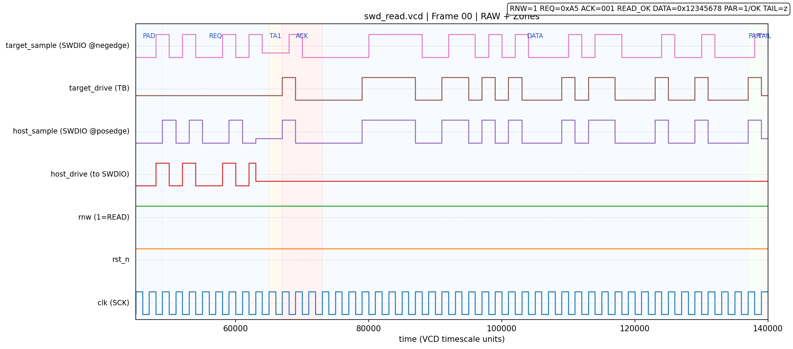
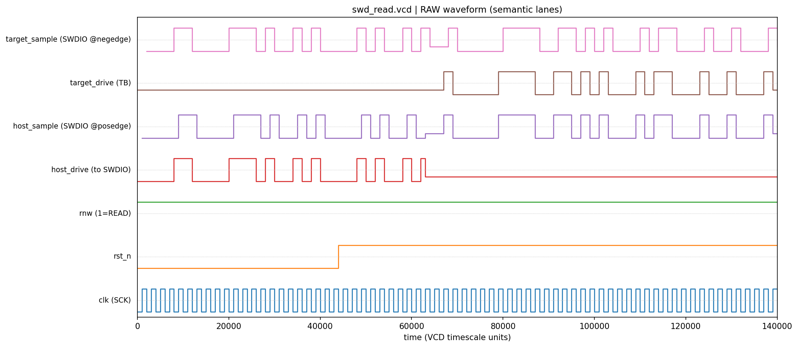
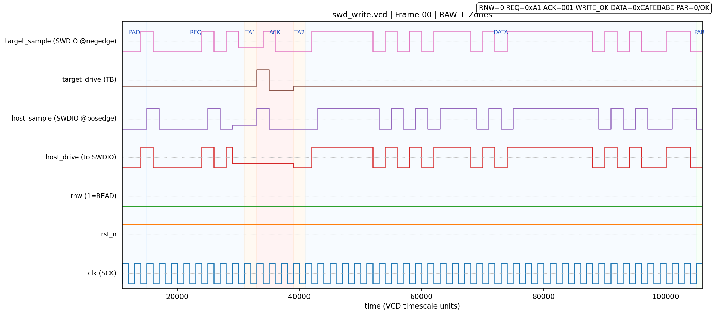
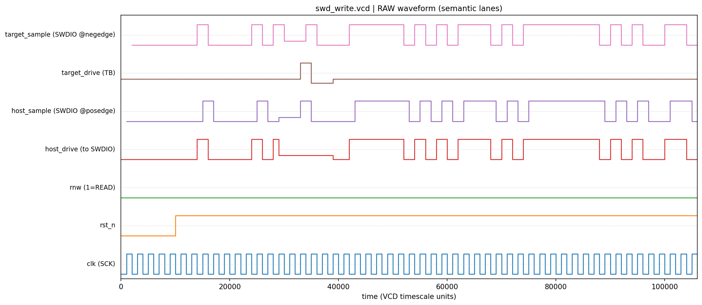
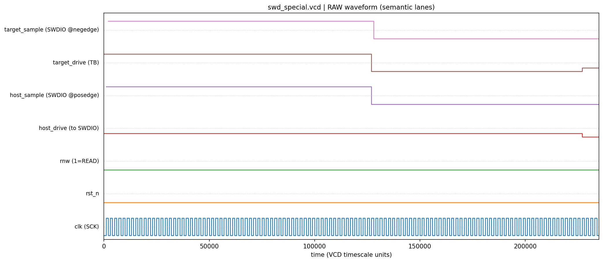

# XRDAP-SWD-Probe

> Open SWD probe (discrete + FPGA) with XRDAP adapter  
> 开源 SWD 探针（分立元件 + FPGA），用于 XRDAP 调试器

---

## 目标 / Goals

实现一个 **成本低、结构简单、行为稳定** 的 SWD 数字前端，使任何带 SPI 接口的主机（MCU / SBC / SoC）都可以：

- 用 **固定 48bit SPI 传输 + 少量 GPIO** 完成标准 SWD 访问；
- 在访问过程中依靠 **DMA / FIFO 连续传输**，避免中途 bit-bang；
- 在较高 SWCLK 频率下，仍然满足 SWD 的 REQ / TURN / ACK / DATA / PARITY / IDLE 时序要求。

---

## 背景问题 / Pain Points

直接使用 MCU + GPIO 软件实现 SWD，常见问题包括：

1. **位宽难以与 SPI 帧对齐**  
   单次 SWD 访问约需 46 个 SWCLK 周期，不方便直接映射到 8/16bit SPI 帧。

2. **总线换向（turnaround）时序敏感**  
   REQ 之后 SWDIO 需在主机与目标之间切换，写访问还可能存在第二次换向；  
   完全由软件控制 IO 方向，在高频下容易产生方向冲突或时序误差。

3. **ACK 分支影响访问流程**  
   SWD 定义 OK / WAIT / FAULT 多种 ACK，软件需根据 ACK 决定是否进入 data phase 或执行错误恢复。  
   在 SPI + DMA 模型下，如希望高效连续传输，需要清晰的访问抽象。

---

## 总体思路 / Approach

### 1. 固定 SPI 帧 + “前 15 位有语义，之后视作 after-ACK 流”

主机侧建议：

- **固定 48bit SPI 帧**，LSB first；
- 每次 SWD 访问 = 一帧 SPI 传输（DMA 发送 6 字节）；
- 每帧开始前短暂拉低一次 `rst_n`，作为该帧的逻辑复位。

前端的抽象更简单：

- 仅在 `rst_n` 拉高后的 **前 15 个 SWCLK 上升沿** 精细区分 bit 位置；
- 第 15 个上升沿之后的所有时钟，一律视作 **“ACK 之后的比特流（after-ACK stream）”**：
  - 不再关心具体 bit 序号；
  - 不依赖“固定 48bit 帧长度”的假设；
  - 后续行为仅由「这是 ACK 之后」+ RnW + ACK 是否 OK 决定。

> 推荐使用 48bit 帧是方便软件实现；  
> 前端本身只区分“前 15 位”和“之后所有位”。

#### 1.1 前 15 位的逻辑布局（前端视角）

以 `rst_n` 从 0→1 后的 SWCLK 上升沿计数 `bit_idx = 0, 1, 2, ...` 为例：

| bit_idx | 角色             | 说明                                                                       |
| ------- | ---------------- | -------------------------------------------------------------------------- |
| 0..1    | PADDING          | 主机输出 0，用于对齐计数器                                                 |
| 2..9    | REQ_WINDOW       | 标准 SWD Request 8bit（主机驱动 SWDIO，LSB-first）                         |
| 10      | TURN1            | REQ→ACK 的 turnaround，前端停止驱动                                        |
| 11..13  | ACK_WINDOW       | 目标驱动 ACK[0..2]，前端采样并解码                                         |
| 14      | 数据/换向分界    | **READ：目标开始驱动 DATA[0]；WRITE：第二次 turnaround（主机可占位或 Z）** |
| ≥15     | AFTER_ACK_STREAM | ACK 之后的比特流，前端不再区分索引                                         |

ACK_WINDOW 中的 3bit 解码为：

- `001` = OK
- `010` = WAIT
- `100` = FAULT
- 其他视作非法，统一 `ack_ok = 0`。

#### 1.2 与官方 SWD 时序对齐（READ / WRITE / IDLE）

为方便对照 ARM 《Serial Wire Debug》规范，下表把 **“SPI 48bit 帧中的逐位行为”** 映射到 **标准 SWD REQ → TURN → ACK → DATA → PARITY → IDLE** 的阶段：

##### READ（ACK=001）

| bit_idx | SWDIO 驱动者 | 官方阶段              | 说明（LSB-first）                                            |
| ------- | ------------ | --------------------- | ------------------------------------------------------------ |
| 0..1    | 主机（MOSI） | Idle/padding          | 人为插入的 2bit idle，确保计数器归零且 SWDIO=0               |
| 2..9    | 主机（MOSI） | Request[0..7]         | `start, APnDP, RnW, A[3:2], parity, stop, park`              |
| 10      | 全线高阻     | Turnaround #1         | 满足“REQ → ACK 至少 1 个周期的总线释放”                      |
| 11..13  | 目标         | ACK[0..2]             | LSB-first                                                    |
| **14**  | **目标**     | **数据开始**          | **DATA0**（READ 只有这一次换向；ACK 后即由目标开始驱动数据） |
| 15..45  | 目标         | DATA[1..31]           | bit45 = DATA31                                               |
| 46      | 目标         | PARITY                | `PARITY = XOR(DATA[31:0])`                                   |
| ≥47     | 全线高阻     | Idle / 下一帧 padding | 可继续输出 SWCLK 作为 idle、dummy 或下一帧的 padding         |

READ 的仿真波形（RAW 波形 + 区块识别/着色）：



RAW 波形：



##### WRITE（ACK=001）

| bit_idx | SWDIO 驱动者       | 官方阶段              | 说明（LSB-first）                    |
| ------- | ------------------ | --------------------- | ------------------------------------ |
| 0..1    | 主机               | Idle/padding          | 同 READ                              |
| 2..9    | 主机               | Request[0..7]         | `start → park`                       |
| 10      | 全线高阻           | Turnaround #1         | 主机释放，等待目标发 ACK             |
| 11..13  | 目标               | ACK[0..2]             | LSB-first                            |
| **14**  | 主机或高阻（可选） | **Turnaround #2**     | **主机可以开始驱动（占位）或保持 Z** |
| 15..46  | 主机（MOSI）       | DATA[0..31]           | bit15 = DATA0，bit46 = DATA31        |
| 47      | 主机（MOSI）       | PARITY                | `PARITY = XOR(DATA[31:0])`           |
| ≥48     | 主机 / 高阻        | Idle / 下一帧 padding | 软件决定是否继续送时钟或进入下一帧   |

WRITE 的仿真波形（RAW 波形 + 区块识别/着色）：



RAW 波形：



##### Idle / Line Reset（RAW 模式）

- **Idle**：在一次访问 ACK 结束后，主机保持 `rst_n=1`、SWDIO 释放，只需继续输出 SWCLK，即可形成任意长度的 idle。  
- **Line reset / SWJ 切换**：把 `rst_n` 拉低到 0 进入 raw 模式后，MOSI 直接透传到 SWDIO。此时在 MOSI 上保持 `1` 并输出 ≥50 个 SWCLK，即可完成 line reset；紧接着输出 `0xE79E` 等 SWJ 序列由主机控制，无额外逻辑插入。



---

## 波形图 y 轴

`vcd_to_png.py --default` 会把 y 轴轨道固定为下列“语义信号”（不做波形修正，仅做呈现/标注）：

- `clk (SCK)`：SPI 时钟 / SWCLK 透传时钟
- `rst_n`：0=RAW 直通；1=正常帧
- `rnw (1=READ)`：1=READ，0=WRITE（访问期间保持不变）
- `host_drive (to SWDIO)`：主机“实际驱动到线上的电平”
- `host_sample (SWDIO @posedge)`：主机在 **posedge** 对 SWDIO 的采样（sample-hold 轨道）
- `target_drive (TB)`：目标（TB）驱动值（`tb_swdio_en ? tb_swdio_val : Z`）
- `target_sample (SWDIO @negedge)`：目标在 **negedge** 对 SWDIO 的采样（sample-hold 轨道）

这套轨道的目的：让“谁在驱动 / 谁在采样 / turnaround 是否真的释放 / 是否存在争用(X)”一眼可见。

---

## 仿真与波形生成 / Simulation & Waveform Rendering

### 1) 运行三套 testbench 并生成 VCD

- Windows / PowerShell：`src/run_all.ps1`
- Linux / macOS / 其它 POSIX 环境：`src/run_all.sh`

正常情况下会生成：

- `src/swd_read.vcd`
- `src/swd_write.vcd`
- `src/swd_special.vcd`

同时 testbench 会逐位输出 timing log，并在末尾汇总 `PASS/FAIL`。

> 当前 testbench 覆盖：RAW、READ(ACK=001)、WRITE(ACK=001)。  
> WAIT/FAULT 分支的“功能性断言”暂未启用，但工具仍可呈现原始波形（用于后续补齐验证）。

### 2) 生成 PNG 波形图

在 `src/` 目录执行：

```powershell
python .\vcd_to_png.py --glob swd_*.vcd --default --mode auto
```

输出目录：

- `src/vcd_png/raw/*.png`：整段 RAW 波形（语义 y 轴）
- `src/vcd_png/frames/*_ZONES.png`：找到可对齐帧时，输出“RAW 波形 + REQ/TURN/ACK/DATA/PAR 区块识别/着色”

---

## SWCLK 行为

- **正常模式 (`rst_n = 1`)**：`swclk = sck`，前端不对时钟做按位 gating。  
- **raw 模式 (`rst_n = 0`)**：同样 `swclk = sck`，同时 `swdio = mosi` 直通。

## MISO 行为

- **正常模式 (`rst_n = 1`)**：`miso` 反射 `swdio`，主机通过 SPI MISO 采样 SWDIO 上的 ACK / DATA / PARITY。  
- **raw 模式 (`rst_n = 0`)**：前端不驱动 `miso`（高阻），SPI 总线上的 MISO 可以被其他从设备复用；主机在 RAW 序列期间不应依赖从本前端读取任何有效数据。

---

## 实现概览 / Implementation

### 分立逻辑版本（四片标准逻辑片，3.3V 目标）

本项目的分立版本目标是：在 **3.3V SWD 目标**下，使用**最少的标准逻辑片**完成与 RTL 等价的前端行为。

#### 逻辑片分解（仅 4 片）

- **U1: 74x161**（4-bit 计数器）
  - `CLK = sck`
  - `CLR_n = rst_n`
  - 用作 “bit_idx” 计数器，并实现 **饱和到 15**（计到 15 后不再回卷）
- **U2: 74x00**（4×NAND）
  - 作为反相器 + 小逻辑（`~RCO`、`raw_mode`、`req_drive`、`write_drive` 等）
- **U3: 74x32**（4×OR）
  - OR 平面（`Q2|Q1`、`raw|req`、最终 `swdio_drive` 汇总等）
- **U4: 74x126**（4×三态缓冲，OE=高有效）
  - 通道 1：将 `mosi` 三态驱动到 `swdio`，实现 TURN/Z 窗口与 READ 数据期释放
  - 通道 2：在 `rst_n=1` 时把 `swdio` 缓冲到 `miso`；`rst_n=0`（RAW）时输出高阻，便于 SPI MISO 复用

> 说明：这里使用 “74x” 作为家族占位符（HC/AHC/AC/LVC…均可）。  
> 你后续可以用不同系列/不同厂家替换测试；只要**引脚语义**匹配即可。

#### 饱和计数（U1 仅靠自身逻辑实现）

`74x161` 正常会 15→0 回卷。为了让计数器**停在 15**，分立版采用：

- `D[3:0] = 1111`
- `LOAD_n = ~RCO`

这样当 `Q==15` 时，`RCO=1`，下一拍 `LOAD_n=0`，同步装载回 15，从而永久保持 15。  
此时 `bit_idx >= 15` 与 `bit_idx == 15` 等价（满足本项目“15 之后不再区分索引”的抽象）。

#### 相位驱动（与 RTL 完全一致）

- `raw_mode = ~rst_n`
- `req_drive = (bit_idx <= 9)`（驱动 padding+REQ：bit 0..9）
- `write_drive = (~rnw) & (bit_idx == 15)`（WRITE 在 ACK 后驱动；READ 保持 Z）

最终：
- `swdio_drive = raw_mode | req_drive | write_drive`
- `swdio       = swdio_drive ? mosi : Z`
- `miso        = rst_n ? swdio : Z`  // RAW 模式下释放 MISO，便于复用
- `swclk       = sck`

#### 引脚语义化 RTL（用于对照原理图）

为了方便你用不同系列器件测试，仓库建议维护一份“按真实引脚编号/别名命名”的门级结构 RTL（每个 IC 模块都有明确 pin 名称，例如 `pin1_1A/pin2_1B/pin3_1Y` 等），用于：

- 将原理图连接表逐项映射到 RTL；
- 在仿真中对拍“分立连线 = 期望行为”。

（后续将把该文件单独放在 `src/` 下，命名示例：`swd_probe_discrete_pinout.v`。）

#### 硬件实现注意（不改变逻辑，但影响可用性）

- 每片 IC 就近放 **0.1uF 去耦**（尤其高频版本）。
- SWDIO 通常需要弱上拉（很多目标板自带；若没有可在探针侧补一个 47k–100k 到 3.3V）。
- 高频（40–50MHz）版本建议在 SWDIO、SWCLK 源端串 22–47Ω 抑制反射/争用尖峰。

### FPGA / RTL 参考实现

仓库提供一份 RTL 参考实现，便于仿真与 FPGA 原型：

- `src/swd-probe.v`  
  - `swd_frontend_top`：实现“前 15 位有语义 + after-ACK 流”的前端行为；  
  - bit 分配与当前 testbench 保持一致：READ 数据从 **bit14** 开始、PARITY 在 **bit46**；WRITE 数据 **bit15..46**、PARITY 在 **bit47**；  
  - RAW 模式：`rst_n=0` 时始终 `swdio=mosi` 直通，同时前端释放 `miso`（高阻）；`rst_n=1` 时 `miso` 反射 `swdio`。

- `src/testbench_read.v`  
  - READ + ACK=OK 的逐位检查与 VCD 生成（每位 log 对调试很关键）。

- `src/testbench_write.v`
  - WRITE + ACK=OK 的逐位检查与 VCD 生成。

- `src/testbench_special.v`
  - raw 模式：line-reset（≥50 个 1）、idle-zero（≥50 个 0）等波形生成。

- `src/tb_timing_helpers.vh`
  - 三套 testbench 共用的逐位检查与 log 输出。

---

## 主机使用约定 / MCU Side

### SPI 建议配置

- 模式：**CPOL = 0, CPHA = 0**（上升沿采样）；  
- 位序：**LSB first**；  
- 帧长：建议 **48 bit**（方便 DMA）；  
- 频率：根据目标板信号完整性评估，通常可从几十 MHz 作为起点。

### 控制信号

- `rst_n`：  
  - 正常访问：帧前在 SCK 静止时拉低一小段时间，然后拉高并开始本次访问；  
  - raw 模式：整个序列期间保持为 0。

- `rnw`：  
  - 1 = READ，0 = WRITE；  
  - 在 `rst_n` 拉高前设置，在访问期间保持不变。

---

## 状态 / Status

- ✅ 前端方案与时序定义（前 15 位 + after-ACK 流）  
- ✅ FPGA / RTL 参考实现与基础仿真  
- ✅ VCD → PNG 波形工具（语义 y 轴 + 区块识别/着色）  
- ⏳ 分立元件原理图（四片标准逻辑片版本：74x161 / 74x00 / 74x32 / 74x126）  
- ⏳ FPGA 顶层封装与 XRDAP 协议适配  
- ⏳ PCB 设计与实机测试

---

## 许可 / License

本仓库仅包含 SWD 前端相关的硬件设计文件（Verilog/RTL、原理图、PCB 等），不包含任何配套软件。

本项目依照《XRDAP-SWD 硬件许可协议 v1》发布，详见仓库中的 `LICENSE`（以中文版本为准）。

对于未被 `LICENSE` 中“禁止对象 / 禁止用途”明确列出的主体和场景：在不修改本设计文件的前提下，任何个人或商业主体均可免费使用、复制、制造和量产基于本未修改版本的硬件产品，无需额外授权或费用。
